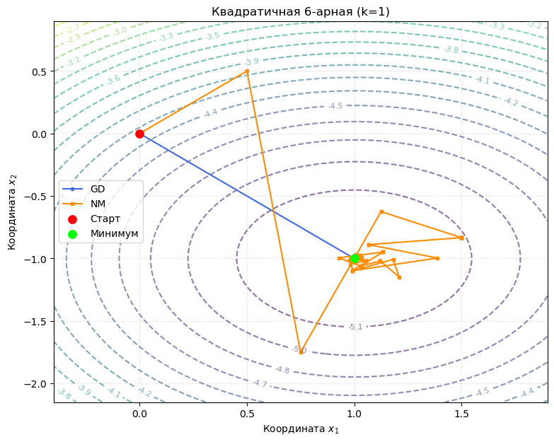
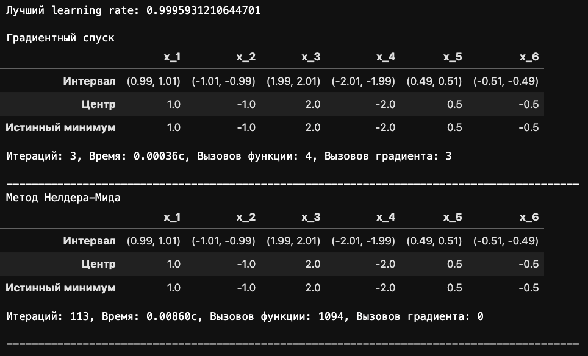
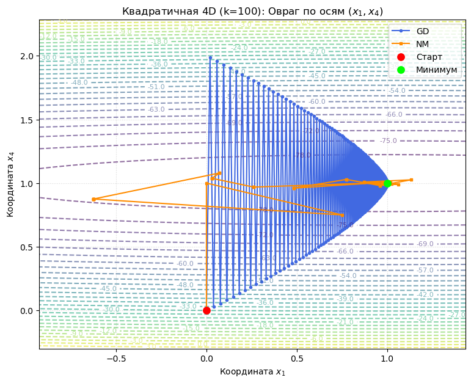
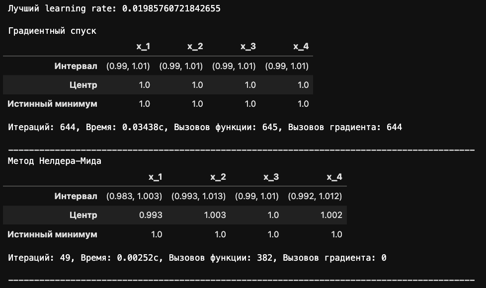
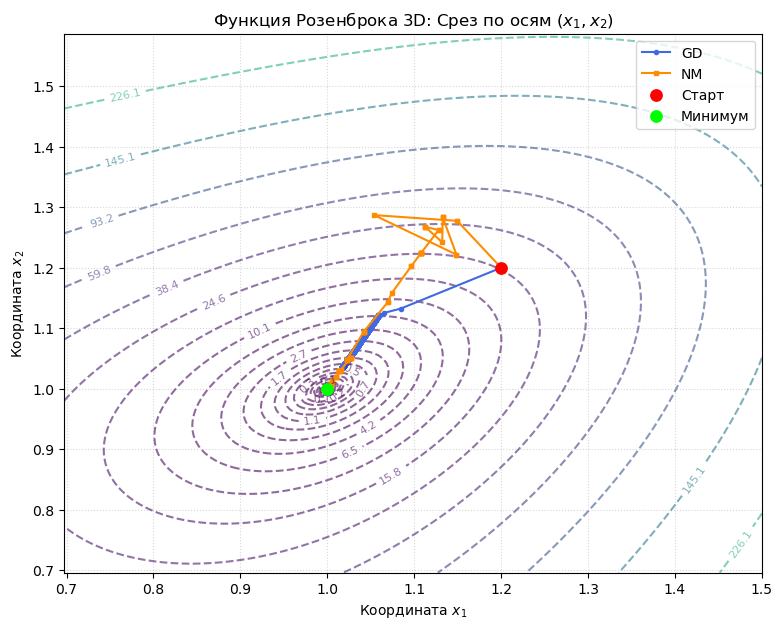
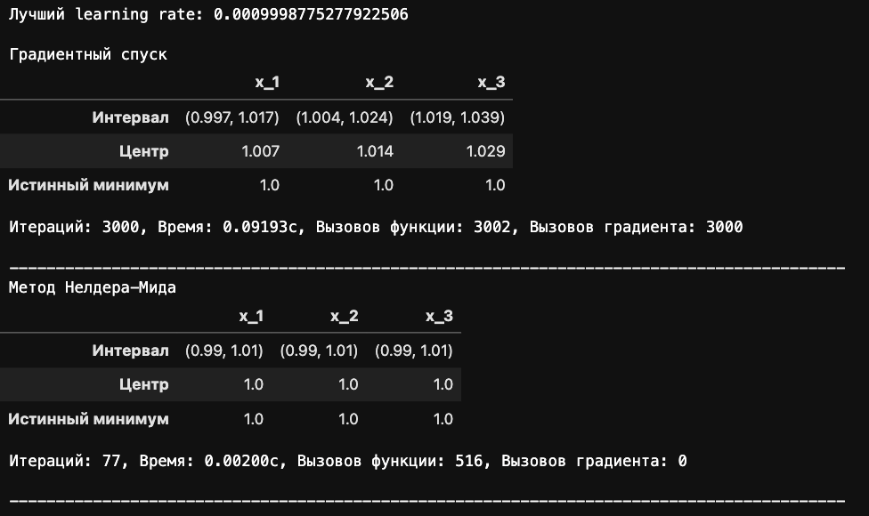
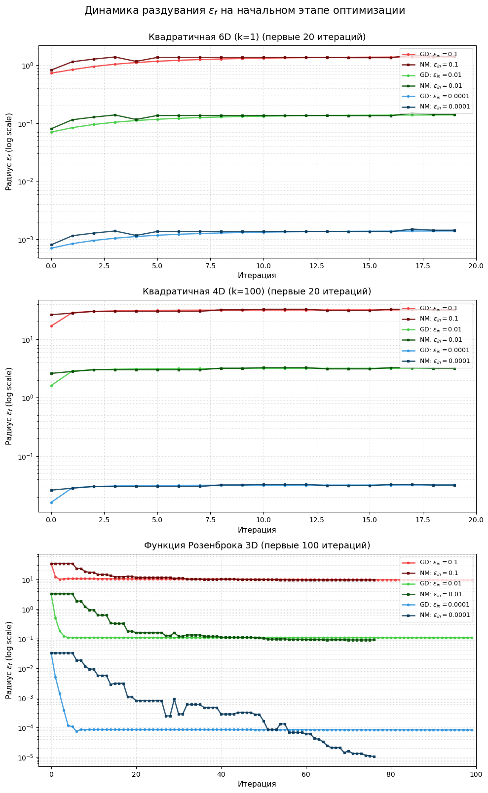

# Отчет по лабораторной работе №1

## Краткая документация по реализованным методам

### ConstructiveNumber.py

Реализован класс `ConstructiveNumber` для работы с конструктивными действительными числами $\left( \mathbb{CR} \right)$.

Реализованные операции:

1) Инициализация числа двумя способами:
   1. `ConstructiveNumber(a, b)`, где `a` - левая граница интервала, а `b` - правая.
   2. `ConstructiveNumber(x, eps)`, где `x` - центр интервала, а `eps` - радиус.
2) Складывать `ConstructiveNumber` с `ConstructiveNumber` и числами
3) Вычитать `ConstructiveNumber` из `ConstructiveNumber` и чисел, и наоборот
4) Умножать `ConstructiveNumber` на `ConstructiveNumber` и числа
5) Возводить `ConstructiveNumber` в положительную степень
6) Сравнивать `ConstructiveNumber` с `ConstructiveNumber` и числами
7) Получать вещественное представление `ConstructiveNumber` (`get_real_value`)

### Functions.py

Реализованы ящики следующих функций:

1) Квадратичная функция `QuadraticFunction`:
    $$f(x) = x^T A x + b^T x + c$$
2) Функция Розенброка (от 3-х переменных) `RosenbrockFunction`:
    $$f(x_1, x_2, x_3) = (1 - x_1)^2 + 100 \cdot (x_2 - x_1^2)^2 + (1 - x_2)^2 + 100 \cdot (x_3 - x_2^2)^2$$

\
Каждый ящик содержит саму функцию `__call__(x)`, ее градиент `gradient(x)` и матрицу Гессе `hessian(x)`. 

Также реализована обёртка `CallCounter`, считающая вызовы методов ящиков.

### Optimization.py

Реализованы требуемые методы оптимизации.

#### Градиентный спуск

За реализацию отвечает класс `GradientDescent`. 

Основной метод класса - `optimize(func, x0, a, tol, max_iters)`, где:
- `func` - функция, которую надо оптимизировать
- `x0` - начальное приближение
- `a` - шаг обучения (по умолчанию `a = 1`)
- `tol` - точность (по умолчанию `tol = 0.001`)
- `max_iters` - максимальное кол-во итераций (по умолчанию `max_iters = 1000`)

#### Метод деформируемого многогранника

За реализацию отвечает класс `DownhillSimplexMethod`. 

Основной метод класса - `optimize(func, x0, alpha=1, beta=0.5, gamma=2, tol=1e-3, max_iters=1000)`, где:
- `func` - функция, которую надо оптимизировать
- `x0` - начальное приближение
- `alpha` - коэффициент отражения (по умолчанию `alpha = 1`)
- `beta` - коэффициент сжатия (по умолчанию `beta = 0.5`)
- `gamma` - коэффициент растяжения (по умолчанию `gamma = 2`)
- `tol` - точность (по умолчанию `tol = 0.001`)
- `max_iters` - максимальное кол-во итераций (по умолчанию `max_iters = 1000`)
    
Также для методов реализован dataclass `OptimizationResult`, хранящий результат оптимизации:
- `x` - найденная оптимальная точка
- `value` - найденное оптимальное значение функции
- `iters` - количество итераций
- `history` - путь оптимизации
- `eps_history` - история значений `eps` для тестов

## Исследования проводимые в работе

### Исследование скорости и качества сходимости методов

> Подбор оптимального learning rate осуществляется с помощью `optuna`

#### Квадратичная 6-арная хорошо обусловленная функция

Число обусловленности функции - число, которое показывает насколько меняется значение функции при небольшом изменении аргумента. \
Хорошо обусловленная функция позволяет допускать небольшие ошибки на входе, которые минимально повлияют на выход. Следовательно на таких функциях методы должны работать предсказуемо устойчиво.

Для квадратичной функции число обусловленности совпадает с числом обусловленности матрицы $A$:
$$\kappa(f) = \kappa(A) = \frac{\lambda_{\text{max}}}{\lambda_{\text{min}}}$$
Зададим $A = \text{diag}(1, 1, 1, 1, 1, 1)$, тогда $\kappa(f) = 1$.

Тестируем: \

Как и ожидалось, GD идеально отрабатывает, сходясь всего за 3 итерации с нулевой (или почти нулевой) погрешностью. Метод деформируемого многогранника тоже сходится с нулевой погрешностью, однако делает 113 итераций и целых 1094 вызова функции. Для таких "хороших" задач этот метод избыточен, GD подходит значительно лучше.

#### Квадратичная 4-арная плохо обусловленная функция

Плохо обусловленная функция соответственно при небольших изменениях аргумента сильно меняет значение, а следовательно методы могут тяжело сходиться и колебаться по всему пространству поиска.

Зададим $A = \text{diag}(1, 10, 50, 100)$, тогда $\kappa(f) = 100$.

Тестируем: \

GD также хорошо сходится, однако заметно влияние плохо числа обусловленности: метод каждый раз сильно перескакивает минимум, поэтому потребовалось 644 итерации чтобы сойтись. Теперь метод деформируемого многогранника показывает себя значительно лучше, отрабатывая всего за 34 итерации. Вещественные значения хоть и получаются хуже, чем у GD, интервалы все равно содержат истинные значения, и в целом это допустимая погрешность при сокращении кол-ва итераций в ~20 раз.

#### Функция Розенброка от 3-х переменных

Тестируем: \

GD ожидаемо работает значительно хуже, так как градиент на пологом овраге не позволяет делать шаги нормальной длины. Метод сходится хуже, чем раньше и не сходится даже за 3000 итераций. Метод деформируемого многогранника идеально справляется с задачей всего за 77 итераций.

> **Вывод** \
> Для макисмально простых задач с идеальными условиями хорошо подходит градиентный спуск, а метод деформируемого многогранника оказывается слишком сложным. \
> Для более сложных задач лучше использовать метод деформируемого многогранника, однако он сам по себе является вычислительно сложным, так как по несколько раз за итерацию может вызывать функцию.

### Исследование изменения epsilon

> **Вывод** \
> На хорошо обусловленной фукнции радиус эпсилон вырастает всего 1.5 - 2 раза и затем сошёлся к постоянной. это и понятно, ведь функция удобная для поиска минимума. \
> На плохо обусловленной функции радиус эпсилон вырастает сильнее - примерно в 5 раз. это и понятно, ведь функция имеет более резкие изменения по сравнению с хорошо обусловленной функцией. \
> На функции Розенброка значение эпсилон подскакивает на несколько порядков на первых итерациях - с $10^{-4}$ до $10^{-2}$. Причина аналогичная - из-за сильного нелинейного множителя вдали от минимума (на больших значениях). Но далее по ходу увеличения итераций ошибка плавно падает и приходит к константе (как и на квадратичных функциях).